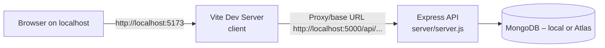
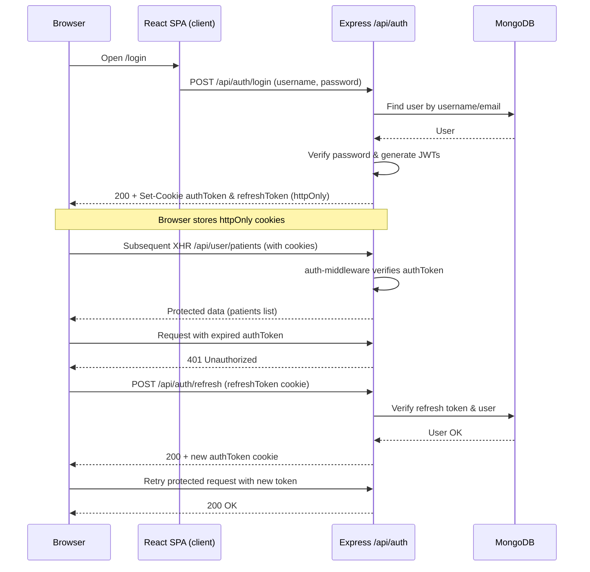
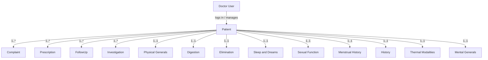
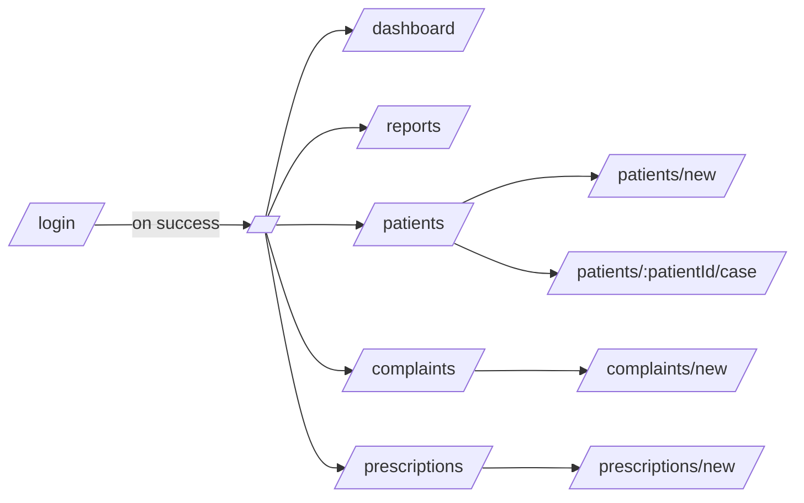
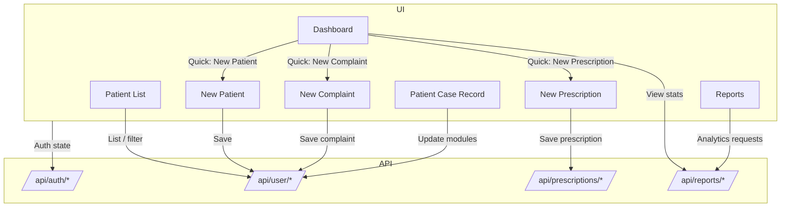
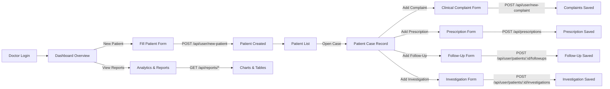

# Medical Case Taking System – Full‑Stack Documentation

> This README describes the **entire project** (frontend + backend + workflows + cloud deployment). It is meant to be the single source of truth for how the system works.

---

## 1. Overview

This project is a **full‑stack medical case‑taking and clinic management system** used by a doctor to manage:

- **Patients** and their demographic details
- **Complaints** and detailed clinical symptoms (location, sensation, aggravation, amelioration, etc.)
- **Structured case record modules** (physical generals, digestion, elimination, sleep & dreams, sexual function, menstrual history, history, thermal modalities, mental generals)
- **Prescriptions**, medicines, follow‑up notes and next‑visit planning
- **Investigations** and their results
- **Follow‑ups** and patient state over time
- **Analytics & reports** for dashboard KPIs, demographics, complaints, prescriptions, follow‑ups and investigations

The system is split into two apps in a single repo:

- **`client/`** – React + Vite SPA (UI for the doctor)
- **`server/`** – Node.js + Express API with MongoDB via Mongoose

Authentication is **JWT‑based** with **httpOnly cookies** and **refresh tokens**; all case‑related APIs are protected.

---

## 2. Tech Stack

### 2.1 Frontend

- **Framework:** React (via Vite)
- **Router:** `react-router-dom`
- **State / Context:** Custom `AuthContext` for auth + per‑page React state
- **Styling:** Tailwind CSS 4 + custom utility classes
- **UI Components:** Radix primitives, custom `ui/*` components, Lucide icons
- **Notifications:** `sonner` toast system
- **Charts & analytics:** `recharts` (used in reports pages)
- **Tooling:** Vite 7, ESLint 9
- **Analytics:** `@vercel/analytics` (optional in production)

### 2.2 Backend

- **Runtime:** Node.js ≥ 18
- **Framework:** Express 5
- **Database:** MongoDB (e.g. MongoDB Atlas) via Mongoose 8
- **Auth:** JWT (`jsonwebtoken`), cookie‑based httpOnly `authToken` + `refreshToken`
- **Security:** `helmet`, strict CORS, `cookie-parser`
- **Validation / errors:** Mongoose validation + centralized error middleware
- **Logging:** `winston` logger (JSON logs, console formatted)
- **Upload support:** `multer` (used in error middleware; ready for file‑upload endpoints)

---

## 3. Repository Structure

```text
medical-case/
├─ client/           # React + Vite SPA (doctor UI)
│  ├─ src/
│  │  ├─ main.jsx   # SPA entry, wraps App with AuthProvider & router
│  │  ├─ App.jsx    # Routes, protected layout, main pages
│  │  ├─ store/auth.jsx
│  │  ├─ pages/     # Dashboard, Patients, Complaints, Prescriptions, Reports, etc.
│  │  └─ components/
│  ├─ package.json
│  └─ vercel.json   # SPA rewrites for client deployment
│
├─ server/           # Express API + MongoDB
│  ├─ api/index.js   # Vercel serverless entry
│  ├─ app.js         # Express app factory (used by serverless)
│  ├─ server.js      # Local dev / traditional server entry
│  ├─ config/db.js   # MongoDB connection (cached across invocations)
│  ├─ routers/       # auth, user, prescription, reports routers
│  ├─ controllers/   # auth, user, prescription, reports controllers
│  ├─ models/        # User, Patient, Complaint, Prescription, FollowUp, etc.
│  ├─ middlewares/   # auth-middleware, error-middleware
│  ├─ utils/logger.js
│  ├─ vercel.json    # Vercel config for API
│  └─ package.json
│
└─ README.md         # (this file) full project documentation
```

---

## 4. High‑Level Architecture

### 4.1 Cloud / Deployment Architecture

The typical production setup uses **Vercel** for both frontend and backend, plus **MongoDB** in the cloud.

```mermaid
flowchart LR
  subgraph UserSide[User Side]
    U[Doctor Browser]
  end

  subgraph Vercel[ Vercel Platform ]
    FE[React + Vite SPA<br/>client/]:::frontend
    EDGE[Vercel Routing]:::infra
    API[Express API as Serverless Fn<br/>server/api/index.js]:::backend
  end

  DB[(MongoDB Cluster<br/>MONGODB_URI)]:::db

  LOGS[(Vercel / External Logs)]:::logs

  U -->|HTTPS GET /| FE
  FE -->|XHR /api/... with credentials| EDGE
  EDGE -->|rewrite /(.*) to /api/index.js| API
  API --> DB
  API --> LOGS

  classDef frontend fill:#2563eb,stroke:#1d4ed8,color:#fff;
  classDef backend fill:#059669,stroke:#047857,color:#fff;
  classDef db fill:#f97316,stroke:#ea580c,color:#fff;
  classDef infra fill:#6b7280,stroke:#4b5563,color:#fff;
  classDef logs fill:#111827,stroke:#6b7280,color:#f9fafb;
```

Key points:

- The **SPA** is built from `client/` and served as static files on Vercel.
- All API requests go to paths like `https://<domain>/api/...`.
- Vercel rewrites every request to `server/api/index.js`, which mounts the Express app from `server/app.js`.
- `connectToDatabase` manages a cached **MongoDB** connection to avoid reconnecting on every invocation.
- Logs are emitted via **winston** to stdout (visible in Vercel / server logs).

### 4.2 Local Development Architecture



In local dev:

- Frontend: `npm run dev` in `client/` → Vite dev server on `http://localhost:5173`.
- Backend: `npm run dev` in `server/` → Express server on `http://localhost:5000`.
- The frontend’s `VITE_APP_URI_API` should normally be `http://localhost:5000` in dev.

---

## 5. Backend (Express API)

### 5.1 App creation & serverless entry

- **`server/app.js`**
  - Creates an Express app.
  - Applies `helmet`, CORS, `cookie-parser`, JSON + URL‑encoded body parsers.
  - Ensures a MongoDB connection (`connectToDatabase`) per request, with a global cache.
  - Adds basic winston logging for method, URL, body, IP.
  - Mounts routers under `/api`:
    - `/api/auth` – `auth-router.js`
    - `/api/user` – `user-router.js`
    - `/api/prescriptions` – `prescription-router.js`
    - `/api/reports` – `reports-router.js`
  - Uses `error-middleware` as the final error handler.

- **`server/api/index.js`**
  - Vercel serverless handler.
  - Lazily creates the Express app by calling `createApp()` from `app.js`.
  - Ensures DB connection is established once (using `isDBConnected` flag) and then re‑uses it.

- **`server/server.js`**
  - Traditional HTTP server for local dev or non‑serverless hosting.
  - Sets up similar middleware & routes directly on `app` and listens on `PORT` (default 5000).

### 5.2 Database Layer

- **`config/db.js`** implements a **global cached connection** to MongoDB:
  - Uses `global.mongoose` to store `{ conn, promise }`.
  - Requires `MONGODB_URI` (throws if missing).
  - Connects with options like `dbName: 'Amruta-Medical'`, `maxPoolSize: 200`, timeouts.

### 5.3 Authentication

#### 5.3.1 Auth Controller

Defined in `controllers/auth-controller.js`:

- **`doctorRegister` (POST /api/auth/register)**
  - Creates the first doctor account using **environment variables only**:
    - `DOCTOR_NAME`, `DOCTOR_USERNAME`, `DOCTOR_EMAIL`, `DOCTOR_PASSWORD`.
  - Ensures no duplicate username.
  - Intended for **system bootstrapping**, not exposed via UI.

- **`doctorLogin` (POST /api/auth/login)**
  - Accepts `{ username, password }` (username or email allowed).
  - Verifies credentials using `userExist.comparePassword(password)` (from `user-model`).
  - On success:
    - Generates `accessToken = userExist.generateToken()`.
    - Generates `refreshToken = userExist.generateRefreshToken()`.
    - Sets httpOnly cookies:
      - `authToken` (short‑lived access token) with `ACCESS_COOKIE_OPTIONS`.
      - `refreshToken` (long‑lived) with `REFRESH_COOKIE_OPTIONS`.
  - Responds with minimal user info: `{ message, userId }`.

- **`getCurrentUser` (GET /api/auth/current)**
  - Reads JWT from either:
    - `authToken` cookie, or
    - `Authorization: Bearer <token>` header.
  - Verifies with `JWT_SECRET_KEY` and decodes `{ userID }`.
  - Fetches the user (sans password) and returns `{ user }`.

- **`logout` (POST /api/auth/logout)`**
  - Clears both `authToken` and `refreshToken` cookies.

- **`refreshAccessToken` (POST /api/auth/refresh)`**
  - Reads `refreshToken` cookie.
  - Verifies with `JWT_REFRESH_SECRET_KEY` (falls back to `JWT_SECRET_KEY` if not set).
  - Loads the user and generates a new access token.
  - Sets a fresh `authToken` cookie and responds with `{ message: "Token refreshed" }`.

#### 5.3.2 Auth Middleware

`middlewares/auth-middleware.js` is applied to all protected routes (patients, complaints, prescriptions, reports):

- Reads JWT from:
  - `req.cookies.authToken`, or
  - `Authorization: Bearer <token>` header.
- Verifies it using `JWT_SECRET_KEY`.
- On success, attaches decoded payload to `req.user` and calls `next()`.
- On failure, responds with `401 { message: 'Unauthorized' }` or `401 { message: 'Invalid or expired token' }`.

#### 5.3.3 Auth Flow (End‑to‑End)



### 5.4 User & Case Management APIs (`/api/user`)

These are defined in `routers/user-router.js` and `controllers/user-controller.js`. **All routes use the auth middleware** and require a valid doctor session.

#### 5.4.1 Patients

- **POST `/api/user/new-patient`** → `createPatient`
  - Creates a new `Patient` document.
  - Validates `patientId`, `name`, `age`, `sex`, and optionally `mobileNo`.
  - Enforces unique `patientId`.

- **GET `/api/user/patients`** → `getAllPatients`
  - Paginated, filterable list of patients.
  - Query params:
    - `page`, `limit`
    - `search` (matches `patientId`, `name`, `address`)
    - `sex`
    - `sortBy`, `order`
    - `dateFrom`, `dateTo` (on `createdAt`)

- **GET `/api/user/patients/:id`** → `getPatientById`
  - Returns a single patient by Mongo `_id`.

#### 5.4.2 Complaints

- **POST `/api/user/new-complaint`** → `createComplaint`
  - Accepts clinical details for a complaint tied to a `patient` (ObjectId).
  - Automatically computes `complaintNo` per patient (1, 2, 3, ...).
  - Validates patient existence and uniqueness of `(patient, complaintNo)`.

- **GET `/api/user/complaint/:patientId`** → `getPatientComplaints`
  - Lists all complaints for a given `patientId` (ObjectId).

- **GET `/api/user/complaints`** → `getComplaints`
  - Paginated complaint listing with filters:
    - `page`, `limit`
    - `patientId`
    - `search` (complaint text, location, sensation, concomitants)
    - `severity`
    - date range via `dateFrom`, `dateTo` on `createdAt`.

- **GET `/api/user/complaints/next-no/:patientId`** → `getNextComplaintNumber`
  - Computes the next `complaintNo` for a patient.

#### 5.4.3 Structured Case Record (One‑to‑One modules)

For each module there are **two endpoints**:

- **GET** `/api/user/patients/:patientId/<module>` → fetch the module if present.
- **PUT** `/api/user/patients/:patientId/<module>` → upsert the module (create or update).

Modules (all one‑to‑one per patient):

- `physical-generals` → `PhysicalCharacteristics`
- `digestion` → `Digestion`
- `elimination` → `Elimination`
- `sleep-dreams` → `SleepDreams`
- `sexual-function` → `SexualFunction`
- `menstrual-history` → `MenstrualHistory`
- `history` → `History`
- `thermal-modalities` → `ThermalModalities`
- `mental-generals` → `MentalGenerals`

All use a generic helper `upsertOneToOneModule(Model, patientId, body)`.

#### 5.4.4 Investigations (Many‑to‑One)

- **GET `/api/user/patients/:patientId/investigations`** → list investigations for a patient.
- **POST `/api/user/patients/:patientId/investigations`** → create investigation for a patient.
- **PUT `/api/user/investigations/:id`** → update an investigation.
- **DELETE `/api/user/investigations/:id`** → delete an investigation.

#### 5.4.5 Follow‑Ups (Many‑to‑One)

- **GET `/api/user/patients/:patientId/followups`** → list follow‑ups for a patient.
- **POST `/api/user/patients/:patientId/followups`** → create a follow‑up.
- **PUT `/api/user/followups/:id`** → update.
- **DELETE `/api/user/followups/:id`** → delete.

### 5.5 Prescriptions API (`/api/prescriptions`)

Defined in `routers/prescription-router.js` and `controllers/prescription-controller.js`.

- All routes are protected by `auth-middleware` (router‑level `router.use(auth)`).

Endpoints:

- **POST `/api/prescriptions/`** → `createPrescription`
  - Body contains `patientId`, `medicines[]`, optional `reason`, `followUpNotes`, `nextVisit`.
  - Requires a patient and at least one medicine.

- **GET `/api/prescriptions/:patientId`** → `getPrescriptionsByPatient`
  - Lists all prescriptions for a patient, newest first.

- **PUT `/api/prescriptions/:id`** → `updatePrescription`
- **DELETE `/api/prescriptions/:id`** → `deletePrescription`

### 5.6 Reports & Analytics API (`/api/reports`)

Defined in `routers/reports-router.js` and `controllers/reports-controller.js`. All routes are protected.

- **GET `/api/reports/dashboard`** → `getDashboardStats`
  - Returns overview counts and summaries for the dashboard:
    - Total/new patients, patient growth, total complaints/prescriptions.
    - Upcoming follow‑ups, gender distribution, age distribution.
    - Recent patients and recent prescriptions.

- **GET `/api/reports/patients`** → `getPatientAnalytics`
  - Demographics and trends for patients (filtered by date range, sex, age range).

- **GET `/api/reports/complaints`** → `getComplaintAnalytics`
- **GET `/api/reports/prescriptions`** → `getPrescriptionAnalytics`
- **GET `/api/reports/followups`** → `getFollowUpAnalytics`
- **GET `/api/reports/investigations`** → `getInvestigationAnalytics`

- **GET `/api/reports/patient/:patientId`** → `getPatientReport`
  - Aggregates all data for a single patient into a rich report:
    - Patient summary, complaints, prescriptions, follow‑ups, investigations.
    - Complaint & prescription analysis.
    - Treatment progress based on follow‑up `patientState`.
    - Case record completion summary.

> **Note for contributors:** Some report aggregations were originally written assuming certain structures (e.g. complaints inside an array). Always check the current **schema** definitions before extending these endpoints.

### 5.7 Data Model Relationships (Conceptual)



### 5.8 Error Handling & Logging

- **`middlewares/error-middleware.js`** centralizes error handling:
  - Logs via `logger.error` with message, stack, URL, method, IP.
  - Specially handles:
    - `multer.MulterError` (e.g. file size limits)
    - Mongo `ValidationError`, `CastError`, duplicate key errors (`code === 11000`)
    - JWT errors (`JsonWebTokenError`, `TokenExpiredError`)
  - Hides internal details in production (`NODE_ENV === 'production'`).

- **`utils/logger.js`** uses `winston`:
  - Timestamped JSON logging.
  - Pretty console output for local dev.

---

## 6. Frontend (React + Vite SPA)

### 6.1 Entry & Application Shell

- **`src/main.jsx`**
  - Wraps the app with:
    - `<AuthProvider>` – manages auth state and API base URL.
    - `<BrowserRouter>` from `react-router-dom`.
    - `<Toaster>` from `sonner` for notifications.
    - `<Analytics />` from `@vercel/analytics` (optional in prod).

- **`src/App.jsx`**
  - Defines main routes using `<Routes>` and `<Route>`:
    - `/login` → `DoctorLoginPage`.
    - `/` → `AuthenticatedRoute` → `MasterLayout` with nested routes:
      - `dashboard` (or `/`) → `Dashboard`.
      - `reports` → `Reports`.
      - `patients` → `PatientList`.
      - `patients/new` → `NewPatient`.
      - `patients/:patientId/case` → `PatientCase` (case record & modules).
      - `complaints` → `ComplaintList`.
      - `complaints/new` → `NewComplaint`.
      - `prescriptions` → `PrescriptionList`.
      - `prescriptions/new` → `NewPrescription`.
    - `*` → `NotFound`.



### 6.2 Auth Context (`src/store/auth.jsx`)

`AuthProvider` is the **single source of truth** for authentication state on the frontend.

- **State:**
  - `user` – current logged‑in user object (or empty string).
  - `isDoctor` – boolean role flag from `user`.
  - `isLoading` – auth loading state.
  - `API` – base API URL from `VITE_APP_URI_API` (fallback `http://localhost:5000`).
  - `isLoggedIn` – derived boolean (`!!user`).

- **Key methods:**
  - `userAuthentication(options)` – calls `GET {API}/api/auth/current` with `withCredentials: true`.
    - On `401` and if `skipRefresh` is false, calls `/api/auth/refresh` then retries once.
  - `login(username, password)` – `POST /api/auth/login` then `userAuthentication()`.
  - `LogoutUser()` – `POST /api/auth/logout`, clears local state and redirects to `/`.

- **Side effects:**
  - `useEffect` on mount → immediately tries to authenticate (for persisted sessions via cookies).
  - Another `useEffect` logs `isDoctor` changes for debugging.

`useAuth()` hook exposes all of this to components.

### 6.3 Route Guard (`AuthenticatedRoute`)

Defined in `components/layout/Authentic-Routes.jsx`:

- Uses `useAuth()` to read `user`, `isLoading`, `isLoggedIn`.
- While auth is loading:
  - Shows `Loader` or `MasterLoader`.
- If **not** logged in:
  - Redirects to `/login`, preserving `location` in route state.
- If already logged in and path starts with `/login`:
  - Redirects to `/` to prevent revisiting login.

### 6.4 Dashboard (`src/pages/Dashboard.jsx`)

- Calls **`GET {API}/api/reports/dashboard`** with `withCredentials: true`.
- Renders:
  - KPI cards (total patients, new this month, prescriptions this month, pending followups).
  - Quick actions: New Patient, New Complaint, New Prescription.
  - Recent patients with navigation to full case.
  - Demographics: gender distribution, age groups.

This page is the main entry to **all workflows**.

### 6.5 Patients List (`src/pages/patients/PatientList.jsx`)

- Calls **`GET {API}/api/user/patients`** with filters and pagination.
- Features:
  - Search (ID, name, address), gender filter, date range filter, sort order.
  - Desktop table + mobile card view.
  - Actions:
    - Open full case record.
    - Quick view in `CustomModal`.
    - Add complaint.
    - Add prescription.

### 6.6 Typical UI → API Mappings



---

## 7. End‑to‑End Clinical Workflow

The following diagram captures the **typical doctor workflow** in the app.



---

## 8. Environment & Configuration

### 8.1 Server `.env` (recommended keys)

> Do **not** commit real values to version control. Use sample files or environment management.

- `MONGODB_URI` – connection string to your MongoDB cluster (e.g. Atlas).
- `JWT_SECRET_KEY` – secret for **access tokens**.
- `JWT_REFRESH_SECRET_KEY` – (optional) secret for **refresh tokens** (fallback to `JWT_SECRET_KEY`).
- `NODE_ENV` – `development` or `production`.
- `ALLOWED_ORIGINS` – comma‑separated list of allowed origins for CORS (in addition to built‑in defaults like `http://localhost:5173`).

Doctor bootstrap account:

- `DOCTOR_NAME`
- `DOCTOR_USERNAME`
- `DOCTOR_EMAIL`
- `DOCTOR_PASSWORD`

### 8.2 Client `.env`

- `VITE_APP_URI_API`
  - Base URL of the backend API.
  - Examples:
    - `http://localhost:5000` (local dev)
    - `https://amrutamedical.in` (production, when API is deployed on the same domain)

---

## 9. Running the Project Locally

### 9.1 Prerequisites

- Node.js **≥ 18**
- npm (comes with Node)
- A running MongoDB instance (local or cloud URI)

### 9.2 Backend

```bash
cd server
npm install

# Create .env with MONGODB_URI, JWT_* and doctor credentials
npm run dev      # starts node server.js with nodemon on http://localhost:5000
```

### 9.3 Frontend

```bash
cd client
npm install

# Create .env with VITE_APP_URI_API=http://localhost:5000
npm run dev      # starts Vite on http://localhost:5173
```

### 9.4 Login (doctor)

1. Start backend with valid `.env` including doctor bootstrap variables.
2. Call **once** (via script or REST client) to register the doctor:

   - `POST http://localhost:5000/api/auth/register`

   The controller reads doctor details from env, not from the body.

3. Use `/login` screen in the frontend to log in with `DOCTOR_USERNAME` and `DOCTOR_PASSWORD`.

---

## 10. Production Deployment (Outline)

- **Backend (server/)**
  - Deploy to **Vercel** as a Node serverless function using `server/vercel.json`.
  - Set **environment variables** in Vercel dashboard: `MONGODB_URI`, JWT secrets, doctor credentials, `ALLOWED_ORIGINS`.

- **Frontend (client/)**
  - Deploy to **Vercel** as a static React app using `client/vercel.json` rewrites.
  - Set `VITE_APP_URI_API` to your production API base URL.

- **Domain:**
  - Point your custom domain (e.g. `amrutamedical.in`) to the Vercel project.

---

## 11. Known Issues / Internal Notes

These are technical things to be aware of when extending or debugging the project.

1. **Analytics assumptions vs schema**
   - Some aggregation pipelines in `reports-controller.js` assume older structures (e.g. arrays like `complaints` within a complaint document or `patientId` fields inside subcollections).
   - The actual schema (e.g. `complaint-model.js`) uses **scalar fields** like `complaintText`, `location`, etc. and references the patient via `patient: ObjectId`.
   - Before modifying analytics, **reconcile the schema vs aggregation logic**.

2. **CORS configuration**
   - CORS is strict: only specific origins are allowed by default.
   - In production, be sure to set `ALLOWED_ORIGINS` correctly or you will see "Not allowed by CORS" errors.

3. **Cookies and cross‑site behaviour**
   - Cookies are configured with `sameSite: 'lax'` and `secure` only in production.
   - When deploying API and SPA on **different domains**, double‑check CORS and cookie settings so that `authToken`/`refreshToken` are sent correctly.

4. **Doctor registration endpoint**
   - `/api/auth/register` **must not** be exposed to normal users; it is effectively a **bootstrap** endpoint.
   - Restrict or remove it in production once the doctor account is seeded.

5. **Error messages in production**
   - `error-middleware` hides detailed stack traces in production.
   - For debugging in production environments, rely on **logs** rather than client‑visible messages.

---

## 12. Quick API Reference (Summary)

### Auth

- `POST /api/auth/register` – seed doctor from env.
- `POST /api/auth/login` – login doctor, set cookies.
- `GET /api/auth/current` – current logged‑in user.
- `POST /api/auth/logout` – clear cookies.
- `POST /api/auth/refresh` – refresh access token.

### User / Case

- `POST /api/user/new-patient`
- `GET /api/user/patients`
- `GET /api/user/patients/:id`
- `POST /api/user/new-complaint`
- `GET /api/user/complaint/:patientId`
- `GET /api/user/complaints`
- `GET /api/user/complaints/next-no/:patientId`

Case record modules (GET + PUT per module):

- `/api/user/patients/:patientId/physical-generals`
- `/api/user/patients/:patientId/digestion`
- `/api/user/patients/:patientId/elimination`
- `/api/user/patients/:patientId/sleep-dreams`
- `/api/user/patients/:patientId/sexual-function`
- `/api/user/patients/:patientId/menstrual-history`
- `/api/user/patients/:patientId/history`
- `/api/user/patients/:patientId/thermal-modalities`
- `/api/user/patients/:patientId/mental-generals`

Investigations & follow‑ups:

- `GET/POST /api/user/patients/:patientId/investigations`
- `PUT/DELETE /api/user/investigations/:id`
- `GET/POST /api/user/patients/:patientId/followups`
- `PUT/DELETE /api/user/followups/:id`

### Prescriptions

- `POST /api/prescriptions/`
- `GET /api/prescriptions/:patientId`
- `PUT /api/prescriptions/:id`
- `DELETE /api/prescriptions/:id`

### Reports & Analytics

- `GET /api/reports/dashboard`
- `GET /api/reports/patients`
- `GET /api/reports/complaints`
- `GET /api/reports/prescriptions`
- `GET /api/reports/followups`
- `GET /api/reports/investigations`
- `GET /api/reports/patient/:patientId`

---

## 13. How to Extend Safely

When adding new functionality or fixing bugs:

- **Reuse existing patterns**:
  - Validators & manual checks as in `createPatient` and `createComplaint`.
  - Upsert pattern for one‑to‑one modules.
  - Pagination & filtering patterns from `getAllPatients` and `getComplaints`.

- **Always pass errors to `next(error)`** instead of handling everything inline.

- **Keep frontend ↔ backend contracts in sync**:
  - If you change an API shape, update the consuming React page (`Dashboard`, `PatientList`, etc.).

- **Update this README** if you introduce new modules, routes, or flows.
